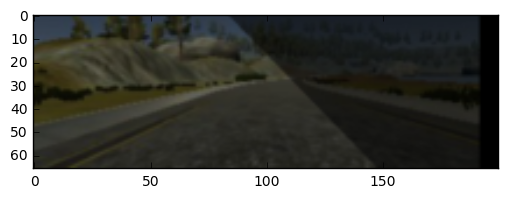

### This is a pretty interesting project. It took me around one month to finish. Here I will explain some of the difficulties I met and how they are overcomed. I will also explained how the training model was built and the Keras structure I used for the model.

1. The most difficult thing at the beginning of the project is I have no idea whether it's the problem of my training data or  my Keras model when the car was only running a few seconds and crash on the roadside of the simulator. These problem was overcomed step by step by improving both of the training data part as well as the Keras model part. For this project I have to say, both the feeding data and the Keras architecture are critical to the final result of the model. 

2. I use a regular Toshiba laptop for the training without a Graph card. For models with 100, 000 parameters it took around 20 min to train 10 EPOCHS and for models with 200, 000 parameters it took around one hour. The training process indeed took me a lot of time, but I could also use the training time to do a lot of side work such as designing the next Keras model. 

3. I only use the sample data provided by the Udacity for training. I do have a joystick, and I tried both the stable and Beta simulators, however, finally I gave up abtaining my own training data. The reason is because whenever I use my own training data or I merged my training data with the sample data, the driving model I got would perform worse than when I use the sample data only. It actually took me more than 10 hours of time for obtaining the training data, but I'm not a good game player, I couldn't control the throttle very well, and turning the corners especially the last two in track 1 was painful at such a high speed. I hope in a real self drving car project I don't have to be the driver by myself.

4. I use the sample data only, but of course only the existing sample data are not enough for obtaining a good model as I have tried the sample data over all the model I have designed and it always failed at the last two corners of Track 1. As a result, the side camera images were included in the training data, and serveral image augmentations, such as changing brightness, flipping, adding random shadow and transforming image within certain range were employed to generate more data for training. Please be noted the side camera method and the image augementation method were copied and modified from the webpage https://chatbotslife.com/using-augmentation-to-mimic-human-driving-496b569760a9#.lx3y9nl5a. Details will be explained in the main body.

5. A data generator was used for generating data. The generator keeps generating 32 data randomly from the training data per batch. As the training data contains too many zero steering angles which might cause the car having a tendency of driving straigt forward, a keeper was used to filter out part of the data with low steering angles. The idea of the keeper was also from the webpage https://chatbotslife.com/using-augmentation-to-mimic-human-driving-496b569760a9#.lx3y9nl5a and it was modified to accormodate my own code.

6. The Keras model I used is the same as the Nvidia paper, with ELU added into each layer to introduce nonlinearity into the model. I also tried several other models by adding different layers such as MaxPooling2D, AveragePooling2D. It turns out that most of the model I designed worked well on the first 3/4 portion of the track, but the car just can't turn over the first corner after the bridge. It seems like most model I designed couldn't extact enough features from the images right after the bridge. If we check those images carefully, we could find in that corner the right line break off for several meters, which becomes the biggest obstacle hindering the success of most models. Anyway, after testing all different layers I find the Nvidia model with ELU() layers is efficient in training the data, and finally wil; give the acceptable result. The idea of introducing ELU was from the webpage of https://chatbotslife.com/learning-human-driving-behavior-using-nvidias-neural-network-model-and-image-augmentation-80399360efee#.4pikhnmrs. The data in the model was normalized into (-1, 1) first. 

7. I tried to resize the images into different sizes. My experience about the image size is that larger size images keep more useful informations and are better for feature extraction. For example, the model using resize of 32×64 images can't pass the bridge which might because it didn't extract the feature for the road on the bridge very well. The model using 48×64 images could pass the bridge with no problem, however, it always failed the first corner after the bridge. It seems like the model has difficulties in extracting enough features that the right line was missing in the corner. Finally I choose to use the 66×200 as the image size, which might provide more information for the model to extract. Of course, the model layers has to be adjusted in order to fit different image sizes, thus, changing the image size actually brings more changes to the model than just changing the size only.


```python
##import modules
import pickle
import numpy as np
import base64
from sklearn.model_selection import train_test_split
import math
import os
import pandas as pd
from scipy import ndimage
import time
import tensorflow as tf
from PIL import Image
import scipy.misc
from io import BytesIO
from sklearn.utils import shuffle
import matplotlib.pyplot as plt
import matplotlib.image as mpimg
import cv2

```


```python
## Define functions for augmentations. Copied and modified from 
## webpage https://chatbotslife.com/using-augmentation-to-mimic-human-driving-496b569760a9#.lx3y9nl5a

## Random change the brightness of the image. Convert the RGB image to HSV, adjust the v channel and convert the image 
## back to RGB
def augment_brightness_camera_images(image):
    image1 = cv2.cvtColor(image,cv2.COLOR_RGB2HSV)
    random_bright = 0.25 + np.random.uniform()
    image1[:,:,2] = image1[:,:,2]*random_bright
    image1 = cv2.cvtColor(image1,cv2.COLOR_HSV2RGB)
    return image1

## Tansform the image along the x-axis or y-axis. Add 0.0033 steering angle units per pixel 
## shift to the right, and minus 0.0033 steering angle units per pixel shift to the left. 
## The number 0.0033 was obtained by testing several different numbers. 
def trans_image(image,steer,trans_range):
    rows, cols = image.shape[:2]
    tr_x = trans_range*np.random.uniform()-trans_range/2
    steer_ang = steer + tr_x*0.0033
    tr_y = 40*np.random.uniform()-40/2
    Trans_M = np.float32([[1,0,tr_x],[0,1,tr_y]])
    image_tr = cv2.warpAffine(image,Trans_M,(cols,rows))
    return image_tr,steer_ang

## Add random shadow to the image. Convert the RGB to HLS and modify the l channel， then convert back to RGB
def add_random_shadow(image):
    top_y = 320*np.random.uniform()
    top_x = 0
    bot_x = 160
    bot_y = 320*np.random.uniform()
    image_hls = cv2.cvtColor(image,cv2.COLOR_RGB2HLS)
    shadow_mask = 0*image_hls[:,:,1]
    X_m = np.mgrid[0:image.shape[0],0:image.shape[1]][0]
    Y_m = np.mgrid[0:image.shape[0],0:image.shape[1]][1]
    shadow_mask[((X_m-top_x)*(bot_y-top_y) -(bot_x - top_x)*(Y_m-top_y) >=0)]=1
    
    if np.random.randint(2)==1:
        random_bright = .5
        cond1 = shadow_mask==1
        cond0 = shadow_mask==0
        if np.random.randint(2)==1:
            image_hls[:,:,1][cond1] = image_hls[:,:,1][cond1]*random_bright
        else:
            image_hls[:,:,1][cond0] = image_hls[:,:,1][cond0]*random_bright    
    image = cv2.cvtColor(image_hls,cv2.COLOR_HLS2RGB)
    return image

## Crop the image, cut and remove the top 1/5 portion, and the bottom 25 pixel of the image. 
## After cutting, the image size is 103×320, then resize the image to 66×200.
def preprocessImage(image):
    
    image = image[math.floor(160/5):(160-25), 0:320]
    image = scipy.misc.imresize(image, (66, 200))
 
    return image

```


```python
%matplotlib inline 
## Open and read the csv file
root = os.getcwd()
root = os.path.split(root)[0]
data_folder = os.path.join(root, 'data')
csv_file = os.path.join(root, 'data\driving_log.csv')
data = pd.read_csv(csv_file, usecols = ['center', 'left', 'right', 'steering'])

## Make a list of the image paths including the center, left and right
image = list(zip(list(data.center), list(data.left), list(data.right)))
steering = list(data.steering)

##Shuffle the data before splitting
center, steering = shuffle(image, steering)

## Split the data into training and validation
path_train, path_valid, y_train, y_valid = train_test_split(image, steering, test_size=0.1, random_state=36) 

## Check the length of train data 
print(len(y_train))


##  Define how to generate a single data
def gen_single(path, y):
    ## Random pick a center, left or right image. If pick left, substract 0.20 to the steer angle. 
    ## If pick right, add 0.20 to the steer angle. 
    image_path, steer = path, y
    dice = np.random.randint(3)
    if dice == 0:
        path_file = image_path[0]
        shift_ang = 0
    if dice == 1:
        path_file = image_path[1]
        shift_ang = 0.20
    if dice == 2:
        path_file = image_path[2]
        shift_ang = -0.20
    steer_plus = steer + shift_ang

    ## Augmentation of the image
    image = cv2.imread(path_file)
    image = cv2.cvtColor(image,cv2.COLOR_BGR2RGB)
    image,steer_plus = trans_image(image, steer_plus, 100)
    image = augment_brightness_camera_images(image)
    image = add_random_shadow(image)
    image = preprocessImage(image)
    image = np.array(image)
    ## Flip the image randomly. If the image is flipped, the sign of steer angle changed.
    ind_flip = np.random.randint(2)
    if ind_flip==0:
        image = cv2.flip(image,1)
        steer_plus = -steer_plus
    return image, steer_plus

## Randomly show an image and its steer angle to check 
rand_num = np.random.randint(len(y_train))
img, steer = gen_single(path_train[rand_num], y_train[rand_num])
print('Steer angle', steer)
plt.imshow(img)
plt.show()


## Define the data generator, batch size is 32
def generate_arrays(path, y, BATCH_SIZE = 32):
    while 1:
        ## Shuffle the whole data each time 
        path, y = shuffle(path, y)
        num_examples = len(y)
        batch_y = np.zeros(BATCH_SIZE)
        batch_X = np.zeros((BATCH_SIZE, 66, 200, 3))

        ## To avoid feeding the model with too many small truning angles, set a keeper to the steer angle. 
        ## If the abs(steer angle) is less than 0.06, the probability of keeping the data in the batch is setting to ~60%.
        for num in range(BATCH_SIZE):            
            keeper = 0
            while keeper == 0:
                rand_index = np.random.randint(num_examples)
                image, steering = gen_single(path[rand_index],y[rand_index])

                if abs(steering) < 0.06:
                    pr_val = np.random.uniform()
                    if pr_val > 0.4:
                        keeper = 1
                else:
                    keeper = 1
            batch_X[num, :, :, :] = image
            batch_y[num] = steering
        yield(batch_X, batch_y)
                        
        

```

    7232
    Steer angle 0.291837469807
    





```python
## Import all the needed keras layers  
from keras.models import Sequential
from keras.layers import Conv2D, Flatten, MaxPooling2D, AveragePooling2D, Dropout, Activation, Dense, Lambda, ELU
from keras.regularizers import l2

## Build the Keras model. The structure of the model was shown by model.summary() as below. 
## The model is similar to the one in the Nvidia paper, with ELU layer added to introduce nonlinearity.
## I tried adding dropout layer into the model, the result is not good.
## I also tested MaxPooling2D, AveragePooling2D etc, they didn't bring too many change to the result, 
## or sometimes make bad result.
model = Sequential()
model.add(Lambda(lambda x: x/127.5-1, input_shape = (66, 200, 3)))
model.add(Conv2D(24, 5, 5, subsample=(2, 2),  border_mode='valid', init = 'he_normal'))
model.add(ELU())
model.add(Conv2D(36, 5, 5, subsample=(2, 2),  border_mode='valid', init = 'he_normal'))
model.add(ELU())
model.add(Conv2D(48, 5, 5, subsample=(2, 2),  border_mode='valid', init = 'he_normal'))
model.add(ELU())
model.add(Conv2D(64, 3, 3, subsample=(1, 1),  border_mode='valid', init = 'he_normal'))
model.add(ELU())
model.add(Conv2D(64, 3, 3, subsample=(1, 1),  border_mode='valid', init = 'he_normal'))
model.add(ELU())

## After convolution, the data was flattened and densed gradually. 
model.add(Flatten())
model.add(Dense(100, init = 'he_normal'))
model.add(ELU())
model.add(Dense(50, init = 'he_normal'))
model.add(ELU())
model.add(Dense(10, init = 'he_normal'))
model.add(ELU())
model.add(Dense(1, init = 'he_normal'))

## Show the summary of the model
model.summary()


```

    Using TensorFlow backend.
    

    ____________________________________________________________________________________________________
    Layer (type)                     Output Shape          Param #     Connected to                     
    ====================================================================================================
    lambda_1 (Lambda)                (None, 66, 200, 3)    0           lambda_input_1[0][0]             
    ____________________________________________________________________________________________________
    convolution2d_1 (Convolution2D)  (None, 31, 98, 24)    1824        lambda_1[0][0]                   
    ____________________________________________________________________________________________________
    elu_1 (ELU)                      (None, 31, 98, 24)    0           convolution2d_1[0][0]            
    ____________________________________________________________________________________________________
    convolution2d_2 (Convolution2D)  (None, 14, 47, 36)    21636       elu_1[0][0]                      
    ____________________________________________________________________________________________________
    elu_2 (ELU)                      (None, 14, 47, 36)    0           convolution2d_2[0][0]            
    ____________________________________________________________________________________________________
    convolution2d_3 (Convolution2D)  (None, 5, 22, 48)     43248       elu_2[0][0]                      
    ____________________________________________________________________________________________________
    elu_3 (ELU)                      (None, 5, 22, 48)     0           convolution2d_3[0][0]            
    ____________________________________________________________________________________________________
    convolution2d_4 (Convolution2D)  (None, 3, 20, 64)     27712       elu_3[0][0]                      
    ____________________________________________________________________________________________________
    elu_4 (ELU)                      (None, 3, 20, 64)     0           convolution2d_4[0][0]            
    ____________________________________________________________________________________________________
    convolution2d_5 (Convolution2D)  (None, 1, 18, 64)     36928       elu_4[0][0]                      
    ____________________________________________________________________________________________________
    elu_5 (ELU)                      (None, 1, 18, 64)     0           convolution2d_5[0][0]            
    ____________________________________________________________________________________________________
    flatten_1 (Flatten)              (None, 1152)          0           elu_5[0][0]                      
    ____________________________________________________________________________________________________
    dense_1 (Dense)                  (None, 100)           115300      flatten_1[0][0]                  
    ____________________________________________________________________________________________________
    elu_6 (ELU)                      (None, 100)           0           dense_1[0][0]                    
    ____________________________________________________________________________________________________
    dense_2 (Dense)                  (None, 50)            5050        elu_6[0][0]                      
    ____________________________________________________________________________________________________
    elu_7 (ELU)                      (None, 50)            0           dense_2[0][0]                    
    ____________________________________________________________________________________________________
    dense_3 (Dense)                  (None, 10)            510         elu_7[0][0]                      
    ____________________________________________________________________________________________________
    elu_8 (ELU)                      (None, 10)            0           dense_3[0][0]                    
    ____________________________________________________________________________________________________
    dense_4 (Dense)                  (None, 1)             11          elu_8[0][0]                      
    ====================================================================================================
    Total params: 252,219
    Trainable params: 252,219
    Non-trainable params: 0
    ____________________________________________________________________________________________________
    


```python
## This part of code is for the convinience of loading the model and weight.
## Sometimes I need to load the trained model and weights and retrain them.
## Please be noted that the model.summary in this part showed an old model I used before, but it's not used in my current model.
from keras.models import Sequential
from keras.layers import Conv2D, Flatten, MaxPooling2D, Dropout, Activation, Dense
from keras.models import model_from_json
from keras.models import load_model

with open('model.json', 'r') as f:
    json_string = f.read()
f.close()
model = model_from_json(json_string)

try:
    model.load_weights('model.h5')
except:
    print("Unexpected error")

model.summary()
```

    Using TensorFlow backend.
    

    ____________________________________________________________________________________________________
    Layer (type)                     Output Shape          Param #     Connected to                     
    ====================================================================================================
    convolution2d_9 (Convolution2D)  (None, 15, 31, 24)    672         convolution2d_input_1[0][0]      
    ____________________________________________________________________________________________________
    maxpooling2d_3 (MaxPooling2D)    (None, 7, 15, 24)     0           convolution2d_9[0][0]            
    ____________________________________________________________________________________________________
    convolution2d_10 (Convolution2D) (None, 5, 13, 48)     10416       maxpooling2d_3[0][0]             
    ____________________________________________________________________________________________________
    convolution2d_11 (Convolution2D) (None, 3, 11, 64)     27712       convolution2d_10[0][0]           
    ____________________________________________________________________________________________________
    convolution2d_12 (Convolution2D) (None, 1, 9, 64)      36928       convolution2d_11[0][0]           
    ____________________________________________________________________________________________________
    dropout_3 (Dropout)              (None, 1, 9, 64)      0           convolution2d_12[0][0]           
    ____________________________________________________________________________________________________
    flatten_3 (Flatten)              (None, 576)           0           dropout_3[0][0]                  
    ____________________________________________________________________________________________________
    dense_9 (Dense)                  (None, 100)           57700       flatten_3[0][0]                  
    ____________________________________________________________________________________________________
    dense_10 (Dense)                 (None, 50)            5050        dense_9[0][0]                    
    ____________________________________________________________________________________________________
    dense_11 (Dense)                 (None, 10)            510         dense_10[0][0]                   
    ____________________________________________________________________________________________________
    dense_12 (Dense)                 (None, 1)             11          dense_11[0][0]                   
    ====================================================================================================
    Total params: 138,999
    Trainable params: 138,999
    Non-trainable params: 0
    ____________________________________________________________________________________________________
    


```python
## Generate the training and validation data
train_generator = generate_arrays(path_train, y_train)
valid_generator = generate_arrays(path_valid, y_valid)

## Choose the loss as 'mean_squared_error' and optimiser 'adam'
model.compile(loss='mean_squared_error',
              optimizer='adam',
              metrics=['accuracy'])

## Train the model, EPOCH is 8
history = model.fit_generator(train_generator,
                    samples_per_epoch = (len(y_train)//32)*32, nb_epoch = 8,
                    validation_data = valid_generator,  nb_val_samples=len(y_valid), 
                    )

json_string = model.to_json()

## Save the model to json file, save the weight
with open('model.json', 'w') as f:
    f.write(json_string)
f.close()
try:    
    model.save_weights('model.h5', overwrite = True)
except:
    print("Unexpected error")
```

    Epoch 1/8
    7232/7232 [==============================] - 282s - loss: 0.0532 - acc: 0.0000e+00 - val_loss: 0.0481 - val_acc: 0.0000e+00
    Epoch 2/8
    7232/7232 [==============================] - 277s - loss: 0.0470 - acc: 0.0000e+00 - val_loss: 0.0446 - val_acc: 0.0000e+00
    Epoch 3/8
    7232/7232 [==============================] - 261s - loss: 0.0456 - acc: 0.0000e+00 - val_loss: 0.0500 - val_acc: 0.0000e+00
    Epoch 4/8
    7232/7232 [==============================] - 246s - loss: 0.0441 - acc: 0.0000e+00 - val_loss: 0.0475 - val_acc: 0.0000e+00
    Epoch 5/8
    7232/7232 [==============================] - 256s - loss: 0.0444 - acc: 0.0000e+00 - val_loss: 0.0499 - val_acc: 0.0000e+00
    Epoch 6/8
    7232/7232 [==============================] - 243s - loss: 0.0454 - acc: 0.0000e+00 - val_loss: 0.0402 - val_acc: 0.0000e+00
    Epoch 7/8
    7232/7232 [==============================] - 254s - loss: 0.0443 - acc: 0.0000e+00 - val_loss: 0.0426 - val_acc: 0.0000e+00
    Epoch 8/8
    7232/7232 [==============================] - 243s - loss: 0.0408 - acc: 0.0000e+00 - val_loss: 0.0403 - val_acc: 0.0000e+00
    


```python

```
